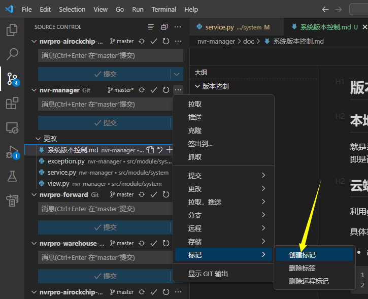
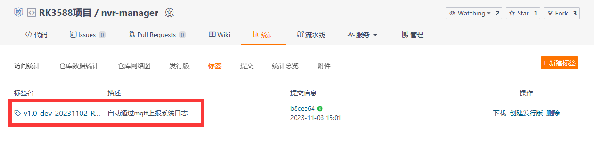
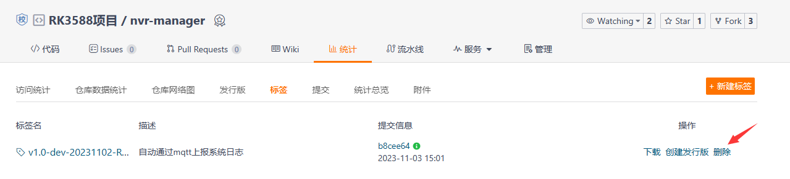

# 版本控制

更新完代码后需要修改两个版本，才能正确更新一次系统的版本。

目前处于开发阶段，版本号可以约定为 `v1.<功能版本>.<修订版本>-dev-<提交日期>`，如 `v1.0.0-dev-20231102`。

* 当追加新功能时：
  * 功能版本+1，修订版本置0
  * 修改简短描述为新版本功能
* 当修复bug或优化系统时：功能版本不变，修订版本+1

*20240104更新：去掉英文描述*

## 更新本地版本

就是系统当前的版本，在config的_VERSION字段里记录，每次修复bug或者添加功能后都要进行版本号的变更，此处的版本号称之为系统本地版本，通过接口返回的即是该版本。

## 更新云端版本

利用git的标签与Gitee来进行云端版本托管，每次一个版本更新后，除了修改本地版本的版本号，还需要手动为当前commit添加标签并推送标签到gitee上。

具体打标签的方法：可通过 `git tag`命令或者vscode或其他IDE的git模块来打标签。

* 命令：

```bash
git tag <lightweght_name>：为当前分支所在的提交记录打上轻量标签。
git tag -a <anotated_name> -m <tag_message>：为当前分支所在的提交记录打上附注标签。
```

* vscode：



然后将标签提交到Git仓库，这个命令可以将所有标签推送上去：

```bash
git push --tags
```



## 删除标签

如果发现提交标签的版本有问题，可以删除。

删除本地标签：`git tag -d <标签名>`

删除云端标签：



# 检查升级（实现逻辑）

检查升级查的是本地版本是否是云端里的最后一个版本，如果不是，则代表当前系统不是最新版，可以升级到最新版，查询所用到的命令如下：

```bash
git ls-remote --refs --tags -q git@gitee.com:research-group-2022/nvr-manager.git
```

输出如下：

```plaintext
dfa0fd8b72ca372ae61def54f4e94e654e4767e8        refs/tags/v1.0-dev-20231102-ReportSyslog
```

因为root用户已经登录ssh，因此有权限执行该命令，该命令会按照标签的字典序返回git里所有标签，且不用扫描一遍整个git仓库，所以运行很快。

得到所有版本号之后，做一个三级版本号排序即可得到最新版本号，比较当前本地版本是否是最新版本号即可实现检查升级的功能。
